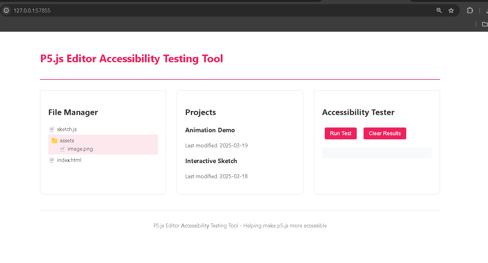

# P5.js Editor Accessibility Tools

This project aims to improve accessibility testing and implementation for the p5.js Editor by providing tools and examples for contributors.

## Features

- ARIA role implementation examples
- Screen reader testing utilities
- Manual accessibility testing guides
- Component examples with accessibility best practices

### **Outout)**


## Getting Started

1. Install dependencies:
```bash
npm install
```

2. Start the development server:
```bash
npm start
```

3. Run tests:
```bash
npm test
```

## Components
- File Manager with ARIA roles
- Project List View with accessibility features
- User Account Settings with screen reader support

## Contributing
This project is designed to help make accessibility testing more approachable for p5.js Editor contributors.
